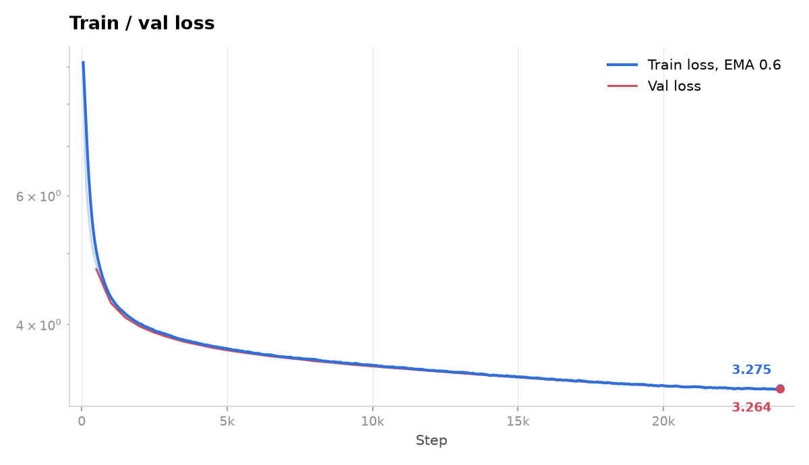
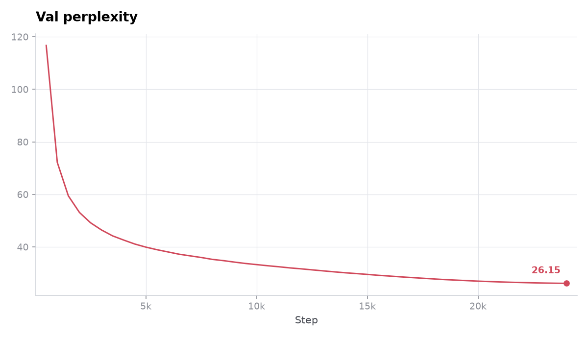

# Transformer Language Model from Scratch

Hello 👋🏻

This is my solution to assignment 1 of Stanford's [CS336: Language Modeling from Scratch](https://cs336.stanford.edu).

Everything here is built directly on raw PyTorch tensors. No `nn.Linear`, no `nn.MultiheadAttention`, no
`F.scaled_dot_product_attention`, no third party tokenizers. The original course README is kept in
[STANFORD_README.md](STANFORD_README.md).

## What is implemented

**Tokenizer** ([`cs336_basics/tokenizer`](cs336_basics/tokenizer))

Byte level BPE trainer with pre-tokenization parallelized across processes and an index of pair occurrences, so each
merge only revisits the words it actually affects. The `Tokenizer` itself handles special tokens, exposes
`encode_iterable` for streaming files that do not fit in memory, and has a multiprocess path for tokenizing a full
corpus to `.npy`.

**Model** ([`cs336_basics/models`](cs336_basics/models))

`Linear`, `Embedding`, `RMSNorm`, `SwiGLU`, `RoPE`, `MultiHeadSelfAttention`, `TransformerBlock`,
`TransformerLM`, plus `softmax`, `scaled_dot_product_attention` and `cross_entropy_loss` written to be numerically
stable.

**Training** ([`cs336_basics/train.py`](cs336_basics/train.py))

`SGD` and `AdamW` written from scratch, cosine learning rate schedule with linear warmup, gradient clipping, memory
mapped batch sampling, checkpointing and resume. Generation supports temperature and top-p sampling.

## Results

A 134M parameter model trained on OpenWebText from scratch, tokenizer included:

|              |                                                              |
|--------------|--------------------------------------------------------------|
| Architecture | 12 layers, `d_model` 768, 12 heads, `d_ff` 2048, context 512 |
| Tokenizer    | own BPE, 32k vocab                                           |
| Optimization | AdamW, lr 1e-3, cosine schedule, bfloat16                    |
| Training     | 24k steps, batch 128, 1.57B tokens                           |
| Wall clock   | 58 min on a single NVIDIA B200                               |
| Final loss   | 3.27 train, 3.26 validation                                  |
| Perplexity   | 26.15 on validation                                          |





A smaller model was also trained on TinyStories and produces coherent short stories. Learning rate and batch size
sweeps, sample generations and the OpenWebText curves are in
[EXPERIMENT_LOG.md](cs336_basics/experiments/EXPERIMENT_LOG.md). Architecture ablations (RMSNorm, post-norm, NoPE,
SwiGLU vs SiLU) live on the `experiments` branch.

## Running it

Dataset download, tokenization and training are described in [PIPELINE.md](PIPELINE.md). Trained BPE artifacts are not
committed, so the tokenizer has to be built first.

## Tests

```shell
uv run pytest ./tests
```

The course test suite passes, except `test_silu_matches_pytorch`. It calls a `run_silu` adapter that no problem in the
handout asks for, while SiLU itself is implemented as part of SwiGLU.
